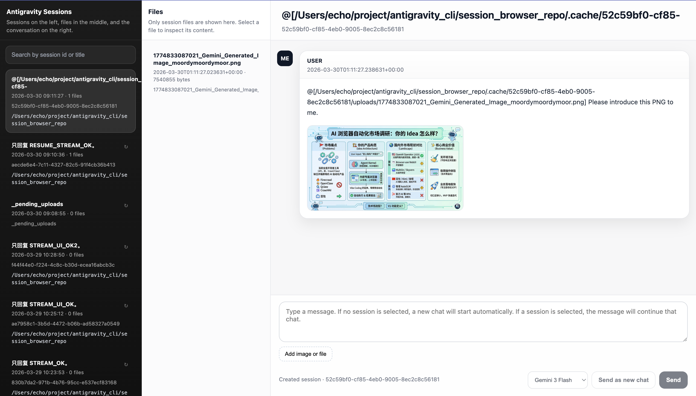

# Antigravity Session Browser

`antigravity-session-browser` is a standalone local Antigravity project that can be published and run on its own.

It is no longer just a viewer. The repo now includes:

- local Antigravity session browsing
- session file and message inspection
- direct chatting from a local web UI
- headless runtime `send` / `resume` / `stream`
- file and image attachments
- session workspace display
- streaming assistant output
- a shared Typer CLI used by both the UI and terminal workflows

## Repository Layout

Core files and directories:

- `store.py`
  The main entry point and Typer CLI. It handles:
  - session listing
  - session files and file content
  - message recovery
  - runtime chat `send` / `resume` / `stream`
  - attachment reads
  - cache warmup

- `ui.py`
  The local web UI. It handles:
  - HTTP APIs
  - invoking the `store.py` CLI
  - rendering sessions, messages, attachments, and file content
  - chat input, uploads, model switching, and the image lightbox

- `runtime_cli/ag_runtime.py`
  The headless Antigravity runtime transport. It handles:
  - launching or discovering the Antigravity runtime
  - ConnectRPC requests
  - `StartCascade`
  - `SendUserCascadeMessage`
  - `GetCascadeTrajectorySteps`
  - incremental assistant output extraction

- `tests/`
  The repo-local test suite, including:
  - `test_ag_runtime.py`
  - `test_runtime_payloads.py`
  - `test_session_browser_store.py`
  - `test_store_cli.py`

## Data Sources

By default, the project reads from:

- `~/.gemini/antigravity/conversations`
- `~/.gemini/antigravity/brain`
- this repository's own `.cache/`

Local project state is stored under:

- `.cache/<session_id>/messages.json`
  The recovered message cache for this project
- `.cache/<session_id>/steps.json`
  Cached runtime steps
- `.cache/<session_id>/uploads/`
  Session-scoped uploaded files

## Running the Web UI

```bash
cd /Users/echo/project/antigravity_cli/antigravity-session-browser
python3 ui.py --host 127.0.0.1 --port 8770
```

Open:

```text
http://127.0.0.1:8770/
```

## Running the CLI

```bash
cd /Users/echo/project/antigravity_cli/antigravity-session-browser
python3 store.py --help
```

## CLI Surface

Top-level commands:

```bash
python3 store.py models
python3 store.py list
python3 store.py files <session_id>
python3 store.py messages <session_id> --refresh
python3 store.py show <session_id>

python3 store.py send "hello"
python3 store.py send "continue" --session <session_id>
python3 store.py resume --session <session_id> "continue"
python3 store.py start "first message in a new chat"
python3 store.py stream "stream a reply"
```

Grouped commands:

```bash
python3 store.py sessions list
python3 store.py sessions files <session_id>
python3 store.py sessions file-content <session_id> <file_name>
python3 store.py sessions file-bytes <session_id> <file_name>
python3 store.py sessions messages <session_id> --refresh

python3 store.py chat send "hello"
python3 store.py chat start "new chat"
python3 store.py chat stream "streaming test"

python3 store.py attachment bytes /absolute/path/to/file
python3 store.py cache warm --limit 20
```

## Web UI Features

The web UI currently supports:

- a session list on the left
- workspace display per session
- a file list in the middle pane
- rendered messages in the right pane
- new-chat sending
- resume sending
- file and image selection before sending
- image thumbnail previews before sending
- click-to-expand image messages
- Markdown rendering
- Markdown table rendering
- model switching

## Model Selection

Both the UI and CLI support model selection.

Default model:

- `Gemini 3.1 Pro (High)` (`1037`)

When Antigravity is running, `store.py models` reads the same
`GetUserStatus.userStatus.cascadeModelConfigData.clientModelConfigs` data used
by the Antigravity model picker.

Current fallback options:

- `Gemini 3.1 Pro (High)` (`1037`)
- `Gemini 3.1 Pro (Low)` (`1036`)
- `Gemini 3 Flash` (`1084`)
- `Claude Sonnet 4.6 (Thinking)` (`1035`)
- `Claude Opus 4.6 (Thinking)` (`1026`)
- `GPT-OSS 120B (Medium)` (`342`)

Override options with `ANTIGRAVITY_MODELS_JSON` or
`~/.config/antigravity-cli/models.json` when Antigravity rotates model ids.

CLI examples:

```bash
python3 store.py send "hello" --model 1037
python3 store.py resume --session <id> "continue" --model 1084
```

## Attachment Flow

Uploaded files do not stay only in the browser.

The flow is:

1. The UI accepts uploaded files.
2. Files are first written to `.cache/_pending_uploads/...`.
3. After a session id is created or resolved, files are moved to:

```text
.cache/<session_id>/uploads/...
```

4. Files are sent to the Antigravity runtime as attachment items:

```json
{
  "item": {
    "file": {
      "absoluteUri": "file:///absolute/path/to/file"
    }
  }
}
```

As a result:

- uploaded files appear in the current session file list
- chat messages in the UI also store attachment metadata

## Workspace Resolution

Session workspaces are not inferred only from free text anymore.

The project first prefers authoritative runtime data from:

- `GetAllCascadeTrajectories`
- `trajectorySummaries[session_id].workspaces[]`

Only when runtime workspace data is unavailable does it fall back to message or artifact path hints.

## Streaming

Chat streaming uses NDJSON events:

- `session`
- `delta`
- `done`

The UI reads `/api/chat/stream` incrementally and updates the conversation view live.

## Tests

The test suite now lives entirely inside this repository under `tests/`.

Run:

```bash
cd /Users/echo/project/antigravity_cli/antigravity-session-browser
python3 -m unittest discover -s tests -p 'test_*.py'
```

Syntax check:

```bash
python3 -m py_compile store.py ui.py runtime_cli/ag_runtime.py tests/test_*.py
```

## Verified So Far

The project has already been verified against these behaviors:

- session uploads are archived under the owning `session_id`
- the new-chat button switches to the new session immediately
- `/api/chat/stream` returns `session -> delta -> done`
- UI chatting works
- file upload works
- image upload works
- image lightbox works
- Markdown table rendering works
- top-level Typer CLI commands work

## What to Commit

Because this is now a standalone repository, the expected commit set is:

- `store.py`
- `ui.py`
- `runtime_cli/`
- `tests/`
- `README.md`
- `.gitignore`

Do not commit:

- `.cache/`
- `.omx/`
- `__pycache__/`

## Development Rules

- Keep this repository self-contained and avoid depending on parent-directory implementations.
- Route the UI through the CLI adapter layer instead of bypassing the CLI.
- Reuse `runtime_cli/ag_runtime.py` for runtime transport concerns.
- For local data that belongs to one session, prefer `.cache/<session_id>/...`.


## UI





## Potential Bugs:

There might still be some minor bugs, but overall, this project seems like a great starting point for handling a variety of session-based tasks in Antigravity.

If you need any help or further guidance on this project, feel free to ask!
