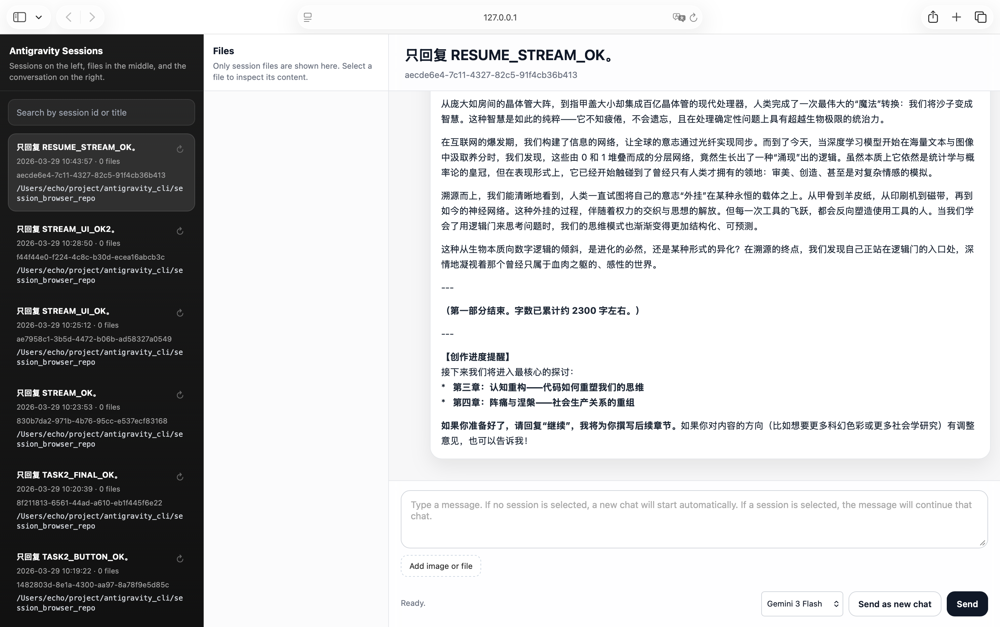
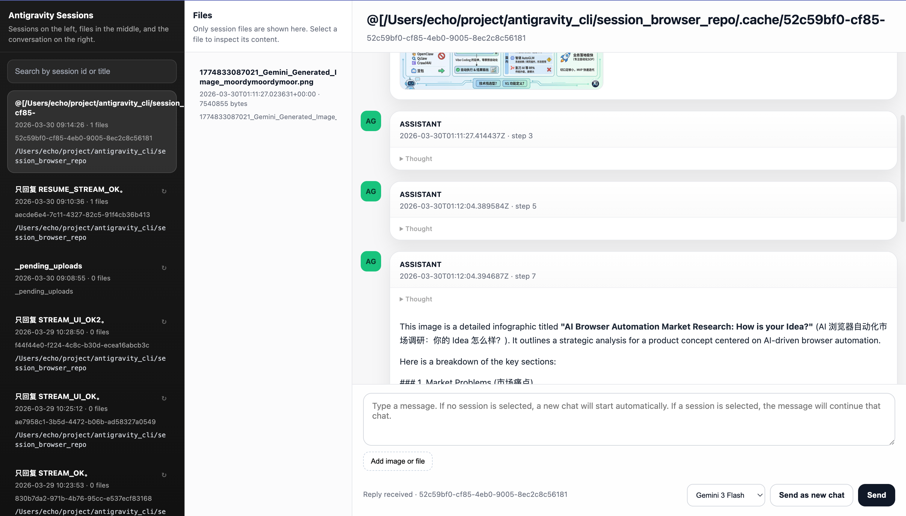
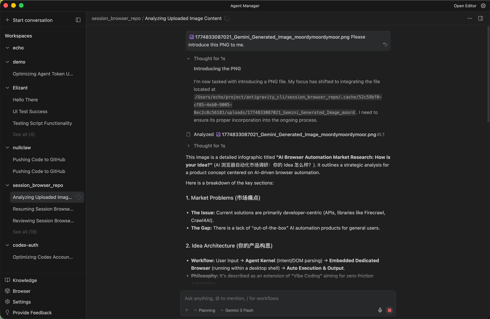

# Antigravity CLI

Antigravity already keeps a rich local trail of conversations, files, model choices, and agent work. This project turns that trail into something you can actually use: a local session browser, a chat composer, a file and image attachment flow, and one terminal command for automation.

It is more than a thin wrapper. `ag` gives you a practical control surface for Antigravity:

- browse local Antigravity sessions and recovered messages
- inspect files attached to each session
- send and resume chats from the terminal
- stream assistant output as it arrives
- upload files and images from CLI or web UI
- switch models using the same model list Antigravity shows in its UI
- diagnose the language server, cache, and local setup

## UI Preview

The local web UI is the fastest way to understand the project: sessions on the left, files in the middle, and the conversation on the right, with a composer, model picker, attachment button, and send controls.








## Quick Start

From a fresh clone, use the repo-local launcher:

```bash
git clone https://github.com/Euraxluo/antigravity-cli.git
cd antigravity-cli

./ag doctor
./ag models
./ag sessions list
./ag ui serve --open
```

For a shell-wide command:

```bash
./setup-ag.sh
export PATH="$HOME/.local/bin:$PATH"

ag doctor
ag models
ag sessions list
ag ui serve --open
```

The launcher bootstraps Python dependencies with `uv`, and can install `uv` automatically when it is missing. You do not need to hand-create a virtualenv for normal use.

## Everyday Commands

```bash
ag ask "summarize this workspace"
ag chat stream "use Gemini Flash" --model-label "Gemini 3 Flash"
ag chat send "continue" --session <session_id>

ag chat send "review this file" --attachment README.md
ag chat send "look at this screenshot" --attachment docs/images/image.png

ag sessions show <session_id>
ag sessions files <session_id>
ag sessions messages <session_id> --refresh

ag ui serve --open
```

Use `--json` where automation matters:

```bash
ag doctor --json
ag models --json
ag sessions list --json
```

## Command Map

| Need | Command |
| --- | --- |
| Check setup | `ag doctor` |
| List live UI models | `ag models` |
| Ask once in a new session | `ag ask "..."` |
| Send to a session | `ag chat send "..." --session <id>` |
| Send with a file or image | `ag chat send "..." --attachment <path>` |
| Stream answer text | `ag chat stream "..."` |
| Browse sessions | `ag sessions list` |
| Inspect files/messages | `ag sessions files <id>` / `ag sessions messages <id>` |
| Open local web UI | `ag ui serve --open` |
| Low-level language-server calls | `ag runtime send/resume/models` |

## What The Pieces Do

Core files and directories:

- `ag`
  Repo-local launcher. It works immediately after cloning and can bootstrap dependencies.

- `ag_cli.py`
  The unified command router for `ag`, `ag-cli`, and `antigravity-cli`.

- `store.py`
  The shared session and chat backend. It handles session listing, file inspection, message recovery, runtime chat, attachment reads, and cache warmup.

- `ui.py`
  The local web UI. It renders sessions, messages, attachments, file content, chat input, uploads, model switching, and the image lightbox.

- `runtime_cli/ag_runtime.py`
  The headless Antigravity language-server transport for `StartCascade`, `SendUserCascadeMessage`, and trajectory-step recovery.

- `tests/`
  Unit coverage for routing, runtime payloads, model discovery, session storage, attachments, and UI surface checks.

## Data Sources

By default, the project reads from:

- `~/.gemini/antigravity/conversations`
- `~/.gemini/antigravity/brain`
- this repository's `.cache/`

Local project state is stored under:

- `.cache/<session_id>/messages.json`
- `.cache/<session_id>/steps.json`
- `.cache/<session_id>/uploads/`

## Model Selection

`ag models` reads the same `GetUserStatus.userStatus.cascadeModelConfigData.clientModelConfigs` payload used by Antigravity's UI model picker.

Current fallback options:

- `Gemini 3.1 Pro (High)` (`1037`)
- `Gemini 3.1 Pro (Low)` (`1036`)
- `Gemini 3 Flash` (`1084`)
- `Claude Sonnet 4.6 (Thinking)` (`1035`)
- `Claude Opus 4.6 (Thinking)` (`1026`)
- `GPT-OSS 120B (Medium)` (`342`)

You can select by id or label:

```bash
ag chat stream "think carefully" --model 1037
ag chat stream "quick answer" --model-label "Gemini 3 Flash"
```

If Antigravity rotates model ids, override the list with `ANTIGRAVITY_MODELS_JSON` or `~/.config/antigravity-cli/models.json`.

## Attachment Flow

Files and images can be sent from both CLI and web UI.

The flow is:

1. The CLI or UI receives a file path or upload.
2. The file is copied into `.cache/<session_id>/uploads/`.
3. The original source file stays in place.
4. The runtime receives the attachment as a file item:

```json
{
  "item": {
    "file": {
      "absoluteUri": "file:///absolute/path/to/file"
    }
  }
}
```

As a result:

- uploaded files appear in the current session file list
- chat messages store attachment metadata
- image attachments render in the web UI and can be opened in the lightbox

## Streaming

Chat streaming uses NDJSON events:

- `session`
- `delta`
- `done`

The UI reads `/api/chat/stream` incrementally and updates the conversation view live.

## Docs

- [Install and bootstrap](docs/install.md)
- [CLI reference](docs/cli.md)
- [Troubleshooting](docs/troubleshooting.md)

Legacy entrypoints still work for compatibility:

```bash
python3 store.py --help
python3 ui.py --help
python3 runtime_cli/ag_runtime.py --help
```

## Verified

The project has been verified against these behaviors:

- `ag` / `ag-cli` / `antigravity-cli` launch correctly
- dynamic model discovery returns the current Antigravity UI model list
- CLI plain messages return assistant output
- CLI file and image attachments are copied, sent, and recoverable
- UI multipart chat stream returns `session -> delta -> done`
- session file and message inspection works
- cache warmup works
- `ag doctor` reports runtime and cache failures honestly
- `python -m unittest discover -s tests` passes
